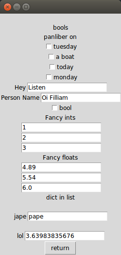

## Auto-gui
### Takes a python object.
``` python
config = {
  "Hey":"Listen",
  "Fancy ints":[1,2,3],
  "Fancy floats":[4.89,5.54,6.0],
  "bool":True,
  "bools":{
      "panliber on":{
        "monday":False,
        "tuesday":False,
        "today":False,
        "a boat":False
      }
    },
  "Person Name":"Oi Filliam",
  "dict in list":[
    {"jape":"pape"},{"lol":3.6398383567566753}
  ]
}

new_config = auto_gui(config)

print(new_config)
```
### Displays a tkinter gui based on that object.

Returns a new object when user is done.
--
``` python
{
  'bools': {'panliber on': {'tuesday': 0, 'a boat': 0, 'today': 0, 'monday': 0}},
  'Hey': 'Listen',
  'Person Name': 'Io Filliam',
  'bool': 0,
  'Fancy ints': [1.0, 2.0, 3.0],
  'Fancy floats': [4.89, 5.54, 6.0],
  'dict in list': [{'jape': 'pape'}, {'lol': 3.63983835676}]
}
```
## Auto-gui was made to work with json.
``` python
import json
fname = "config.json"
with open(fname) as f:
    d = json.load(f)
print(auto_gui(d,fname))
```
